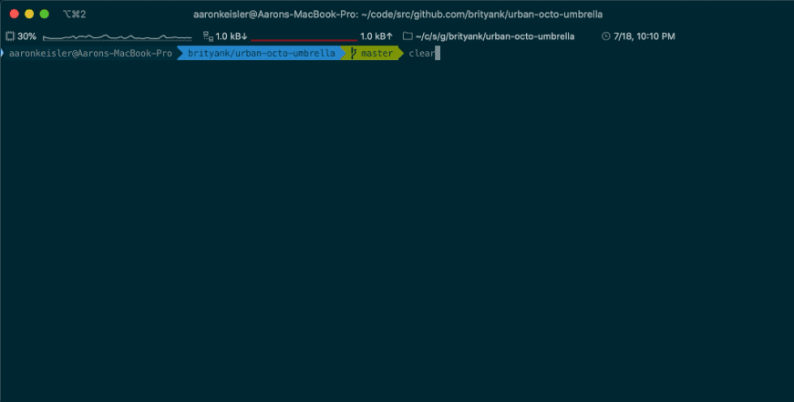

# LIRI

> The Language Information Request Interface

Liri takes in command line parameters and returns results from Spotify, OMDB (Open Movie Database), and BandsInTown.

It utilizes a Spotify npm package for easier request and auth implementation and dotenv to contain the API keys.

It also utilizes the fs core module to read commands from a random.txt file and log output to another log.txt file.



## Installation

### NPM

OS X, Linux & Git Bash:

```sh
npm install liri-brit-js
```

### dotenv

After receiving all API keys, add a .env file to the root folder and edit it as below:


## Usage example

There are five basic commands:

`node liri spotify-this-song` + "song"

- queries spotify and returns information about a track

`node liri spotify-this-artist` + "artist"

- queries spotify and returns information about an artist

`node liri movie-this` + "movie title"

- queries OMDB and returns information about a movie

`node liri concert-this` + "artist"

- queries BandsInTown and returns upcoming concerts

`node liri do-what-it-says`

- reads commands from external file and performs them in sequence
- commands must be written in comma-delimited format

## Progress

- [x] Add logging function
- [x] Make do-what-it-says work with multiple commands
- [ ] Implement Wolfram Alpha general purpose questions

## Meta

Aaron Keisler – [@abritishyank](https://twitter.com/abritishyank) – aaron@keisler.dev

Distributed under the MIT license.

[github.com/brityank/urban-octo-umbrella](https://github.com/brityank/urban-octo-umbrella)